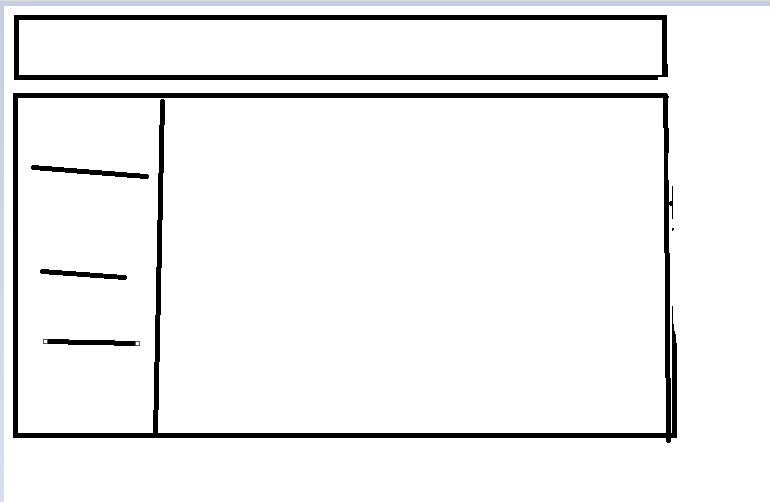
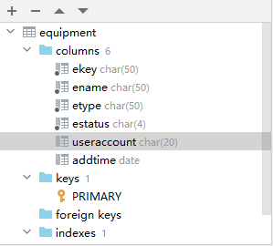
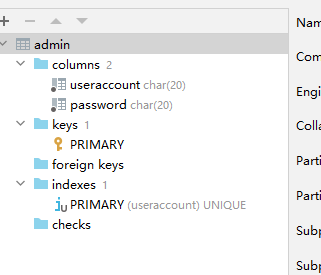
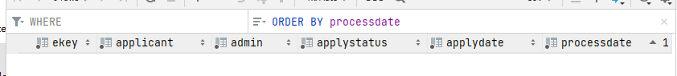

# 页面

使用naive ui
顶部导航栏＋操作区
大概是这个样子

### 顶部导航栏

从左到右：logo、title、user-avatar

#### user-avatar

可能会需要做一个登录的表单

### 操作区

naive ui layout ,左边操作菜单，右边相应页面，根据右边菜单选项改变页面组件，

#### 菜单

naive ui menu
菜单选项：["主页""设备列表","维修记录","添加设备"]

#### 设备列表 表格

使用naive ui n-data-table
列名：["设备名","序号"(key),"设备种类","状态","操作"]

# 页面状态

未登录/已登录

### 未登录

### 已登陆

# 数据库

